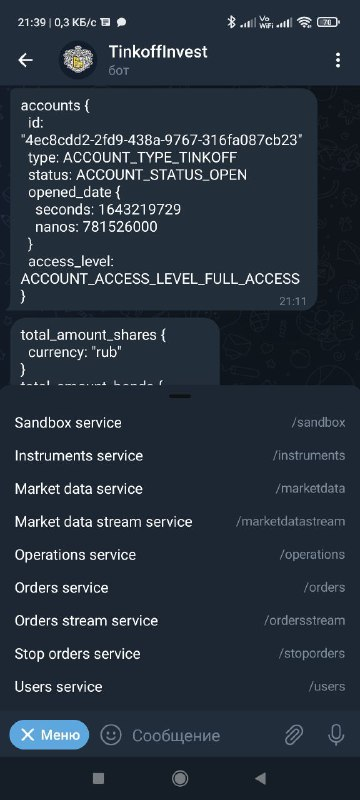
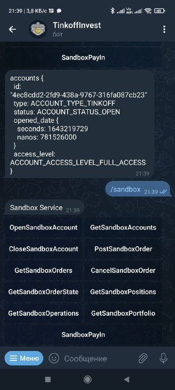

# TinkoffInvestBot
Telegram Bot for TinkoffInvest

## Dependencies

You need to install some dependencies. You may do it with these commands:
```sh
sudo apt-get install g++ make binutils cmake libssl-dev libboost-system-dev zlib1g-dev libcurl4-openssl-dev
```

## Screenshots

 
